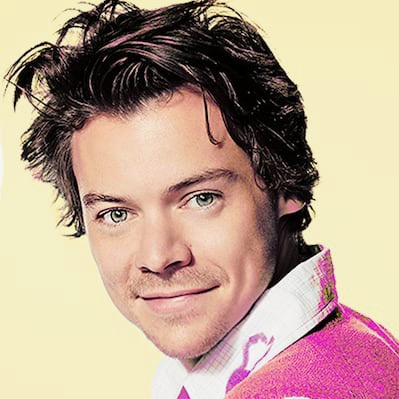

Cross Stitch Fun
================
Rebecca Yang


# Objective

The objective is to demonstrate how create a cross stitch pattern from
an image and select an appropriate amount of colors for the pattern.

# Introduction

Cross stitch is a fun hobby where images are recreated stitch by stitch
on fabric. Obviously, it is impossible to recreate the exact image, but
k-means clustering can help identify the main colors in the image to
best approximate it. Four functions are presented here to help the user
select the best number of colors to use and to create a pattern using
DMC thread colors that is customizable for their cross-stitching needs.

# Example

To demonstrate, let’s make a pattern of Harry Styles’ face. Here is the
picture we want to cross-stitch:

<div class="figure" style="text-align: center">



<p class="caption">

Original image of Harry Styles

</p>

</div>

These are the packages that we will use to run the functions:

``` r
library(imager)
library(tidyverse)
library(tidymodels)
library(sp)
library(scales)
library(cowplot)
library(dmc)
```

## Step 1: Processing the Image

The first function is `process_image`. Images have to be processed and
prepared before they can be used by other functions. `process_image`
takes two inputs:

  - `image_file_name`: the name/file path of the image you want to
    cross-stitch
  - `k_list`: a list of the possible number of colors you are
    considering

In the picture of Harry, I can see 5 main colors: pink and white shirt,
yellow background, skin color, and brown hair. But, his eyes are also
green and there are many darker shades in his hair as well. So, I am
going to consider including between 5 and 8 colors in my final cross
stitch. The subsequent functions will help me decide on a final number
of colors.

We want to save the output as `cluster_info`.

``` r
cluster_info <- process_image("HarryStyles.jpeg", c(5, 6, 7, 8)) 
# k_list should be inputted as a vector
```

At this point, it is possible to get some warnings. This usually means
that the values of k are too high and the algorithm is having trouble
separating the colors in the image into distinct clusters. The maximum
iterations is set to 30, so it may be the case that the algorithm was
unable to converge during these 30 iterations. For this reason,
clusterings are computed 20 times for each value of k, so that the best
result can be used.

`cluster_info` returns a list of two elements. The first element is a
data frame of the image, with columns x and y describing the position
and R, G, B describing the color of each pixel.

``` r
head(cluster_info[[1]])
```

    ##   x y         R         G         B
    ## 1 1 1 0.9647059 0.9333333 0.7411765
    ## 2 2 1 0.9647059 0.9333333 0.7411765
    ## 3 3 1 0.9647059 0.9333333 0.7411765
    ## 4 4 1 0.9647059 0.9333333 0.7411765
    ## 5 5 1 0.9647059 0.9333333 0.7411765
    ## 6 6 1 0.9647059 0.9333333 0.7411765

The second element of `cluster_info` is a nested tibble that contains
the information about the clusterings for each value of k. The `glanced`
and `tidied` columns contain tibbles that are summaries of the k-means
results, with information like the variance within clusters and the
closest DMC thread to each cluster color.

``` r
cluster_info[[2]]
```

    ## # A tibble: 4 x 4
    ##       k kclust   glanced          tidied          
    ##   <dbl> <list>   <list>           <list>          
    ## 1     5 <kmeans> <tibble [1 × 4]> <tibble [5 × 9]>
    ## 2     6 <kmeans> <tibble [1 × 4]> <tibble [6 × 9]>
    ## 3     7 <kmeans> <tibble [1 × 4]> <tibble [7 × 9]>
    ## 4     8 <kmeans> <tibble [1 × 4]> <tibble [8 × 9]>

``` r
head(cluster_info[[2]] %>% pluck("glanced", 3))
```

    ## # A tibble: 1 x 4
    ##    totss tot.withinss betweenss  iter
    ##    <dbl>        <dbl>     <dbl> <int>
    ## 1 47494.        1122.    46371.     4

``` r
head(cluster_info[[2]] %>% pluck("tidied", 3))
```

    ## # A tibble: 6 x 9
    ##        R      G      B  size withinss cluster colours dmc_cols dmc_names        
    ##    <dbl>  <dbl>  <dbl> <int>    <dbl> <fct>   <chr>   <chr>    <chr>            
    ## 1 0.0600 0.0391 0.0357 22732     108. 1       #0F0A09 #1E1108  Black Brown (337…
    ## 2 0.776  0.563  0.523  12975     157. 2       #C69085 #BA8B7C  Rosewood - Light…
    ## 3 0.903  0.740  0.657  24494     184. 3       #E6BDA8 #EBB7AF  Shell Pink - Ver…
    ## 4 0.280  0.210  0.203   9486     116. 4       #473634 #4B3C2A  Mocha Brown - Ve…
    ## 5 0.860  0.319  0.623   8465     172. 5       #DB519F #C54989  Plum - Light (36…
    ## 6 0.543  0.387  0.367   9038     148. 6       #8A635D #7F6A55  Beige Gray - Ult…

## Step 2: Choosing Colors

Now that we have all of this information, we can figure out how many
colors we should include. There are two functions to help us do this.

The first is `scree_plot` (Figure 2), which takes `cluster info` and
graphs a plot with the number of clusters on the x-axis and the total
within group sum of squares for each clustering on the y-axis, which is
basically a measure of how similar the colors within each clustering
are. When there are large dips, like between 5 and 6 clusters, it means
that the colors in each of the 6 clusters are a lot more similar than
the colors in the 5 clusters, so it is a better grouping. From 7 to 8
clusters, the drop off is not as significant, but is still a difference
of 1000, so 8 clusters may be better.

``` r
scree_plot(cluster_info)
```

<div class="figure" style="text-align: center">


<p class="caption">

Scree Plot

</p>

</div>

To further investigate this, we can look at the actual colors of each
clustering (Figure 3).

``` r
color_strips(cluster_info) 
```

<div class="figure" style="text-align: center">


<p class="caption">

Color Strips for Each Clustering

</p>

</div>

We can see that when k=8, we get an off-white color that we did not get
with any of the previous clusterings. Since we want Harry to have a nice
white collar, our preferred number of clusters is k=8.

## Step 3: Making the Pattern\!

Now that we’ve decided on the number of colors, we can make the pattern
using the `make_pattern` function, which allows for several
customizations to the pattern:

  - `k` - the number of colors
  - `x_size` - how many stitches you want in the x-direction of the
    pattern; the y-direction will be proportionately calculated
  - `black_white` - option to make the pattern in black and white;
    default is FALSE
  - `background_color` - option to specify a background color from the
    pattern; default is NULL

In Figure 4, we make a pattern with 8 colors that is 40 stitches across
with the default settings (all colors included in the pattern and colors
are shown).

``` r
make_pattern(cluster_info, k = 8, x_size = 40)
```

<div class="figure" style="text-align: center">


<p class="caption">

Default pattern

</p>

</div>

We can also customize our pattern in a number of ways. First, we can
make it black and white. This can be helpful for the lighter colors that
are hard to see or if you want to print in black and white (Figure 5).
To do so, set `black_white = TRUE`.

``` r
make_pattern(cluster_info, k = 8, x_size = 40, black_white = TRUE)
```

<div class="figure" style="text-align: center">


<p class="caption">

Black and white pattern

</p>

</div>

If we didn’t want this yellow background in the pattern, it can be
removed (Figure 6). We can simply refer back to the output of
`color_strips` to identify the hex code of the color (should be in the
form \#FFFFFF) to tell the function to omit it through the
`background_color` argument.

``` r
make_pattern(cluster_info, k = 8, x_size = 40, background_color = "#F5ECCB")
```

<div class="figure" style="text-align: center">


<p class="caption">

Without background color

</p>

</div>


A word of caution on this: Sometimes the background color is used in the
actual image. In this case, we can see that Harry is missing some of his
forehead because they were closer to that yellow color than the rest of
his skin. So we would have to be mindful of this and adjust the pattern
ourselves when using it.

# Notes

Sometimes the pattern may have less colors than what was specified. This
is because the resolution of the image is reduced in order to make the
pattern, so insignificant colors may be lost in this process.
